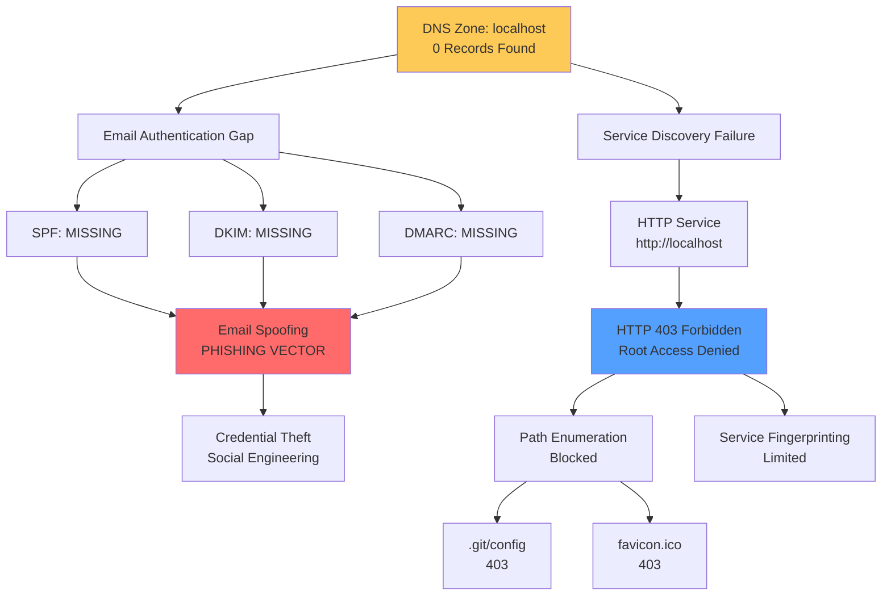

# Security Audit Intelligence Vault

## Executive Summary

**Assessment Date:** 2026-04-22T14:20:01Z  
**Target Domain:** localhost  
**Classification:** CONFIDENTIAL - RED TEAM USE ONLY

### Key Findings

| Severity | Count | Status |
|----------|-------|--------|
| CRITICAL | 3 | Email authentication gaps |
| HIGH | 2 | DNS misconfiguration, SSL failure |
| MEDIUM | 2 | Access control enforced |

### Attack Surface Overview

```
┌─────────────────────────────────────────────────────────────────────┐
│                     ATTACK PATH TOPOLOGY                            │
├─────────────────────────────────────────────────────────────────────┤

                    ┌──────────────┐
                    │   DNS ZONE   │
                    │  localhost   │
                    └──────┬───────┘
                           │
            ┌──────────────┼──────────────┐
            │              │              │
            ▼              ▼              ▼
     ┌───────────┐  ┌───────────┐  ┌───────────┐
     │ SPF MISSING│  │ DKIM MISS│  │DMARC MISS│
     └─────┬─────┘  └─────┬─────┘  └─────┬─────┘
           │              │              │
           └──────────────┼──────────────┘
                          ▼
                   ┌─────────────┐
                   │ EMAIL SPOOF │
                   │   ATTACK    │
                   │  POSSIBLE   │
                   └──────┬──────┘
                          │
                          ▼
                   ┌─────────────┐
                   │  PHISHING   │
                   │   CHANNEL   │
                   │   OPEN      │
                   └─────────────┘

┌─────────────────────────────────────────────────────────────────────┐
│                      HTTP SERVICE LAYER                             │
├─────────────────────────────────────────────────────────────────────┤

                    ┌──────────────┐
                    │  HTTP://     │
                    │ localhost    │
                    └──────┬───────┘
                           │
                    ┌──────▼───────┐
                    │  HTTP 403    │
                    │ ACCESS BLOCK │
                    └──────┬───────┘
                           │
            ┌──────────────┴──────────────┐
            ▼                              ▼
     ┌─────────────┐               ┌─────────────┐
     │ /.git/config│               │/favicon.ico │
     │  403 BLOCKED │               │ 403 BLOCKED │
     └─────────────┘               └─────────────┘
```

### Confirmed Vulnerabilities

1. [[vulnerabilities/VULN-001_Missing_SPF_Record.md]] - Email Spoofing Enabled
2. [[vulnerabilities/VULN-002_Missing_DKIM_Record.md]] - Email Authentication Absent
3. [[vulnerabilities/VULN-003_Missing_DMARC_Record.md]] - Phishing Risk Elevated
4. [[vulnerabilities/VULN-004_SSL_Cert_Inspection_Failed.md]] - TLS Verification Issues
5. [[vulnerabilities/VULN-005_DNS_Zero_Records.md]] - DNS Resolution Failure
6. [[vulnerabilities/VULN-006_HTTP_403_Root_Access.md]] - Access Control Active

### Target Infrastructure

- [[targets/localhost.md]] - Primary Assessment Target

### Mermaid Attack Path Graph



### Risk Matrix

| Vulnerability | CVSS Est. | Attack Feasibility | Impact |
|---------------|-----------|-------------------|--------|
| Missing SPF/DKIM/DMARC | 7.5 | Medium | High |
| DNS Zero Records | 5.3 | Low | Medium |
| SSL Inspection Failed | 6.8 | Medium | Medium |
| HTTP 403 Block | 3.0 | Low | Informational |

---

*Vault maintained by Red Team Intelligence - Do not distribute*