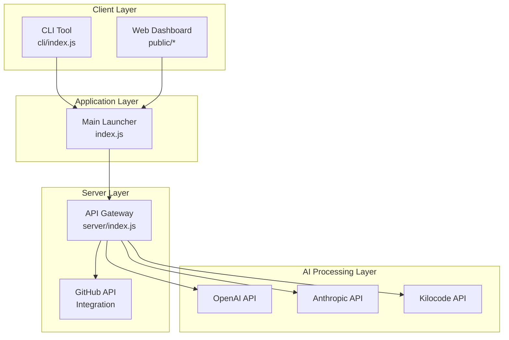

Act as an expert developer. Based on the following system specification, create a comprehensive implementation blueprint.

---

# พิมพ์เขียวระบบ REVERSE ENGINEER: ระบบวิเคราะห์และถอดโครงสร้าง GitHub ด้วย AI

## 1. EXECUTIVE SUMMARY (บทสรุปผู้บริหาร)

**วัตถุประสงค์หลัก:** ระบบ Reverse Engineer เป็นเครื่องมือสำหรับนักพัฒนาที่ต้องการวิเคราะห์โค้ดจาก GitHub Repository และสร้างพิมพ์เขียวทางเทคนิค (Technical Blueprint) โดยใช้ AI ช่วยในการถอดตรรกะและโครงสร้างของโปรเจกต์ เพื่อให้สามารถนำไปสร้างหรือปรับปรุงระบบใหม่ได้

**เป้าหมายทางธุรกิจ:**
- ช่วยให้นักพัฒนาศึกษาโค้ดของโปรเจกต์ใหญ่ๆ ได้รวดเร็ว
- สร้างเอกสารทางเทคนิคที่ละเอียดเพียงพอสำหรับ AI ตัวอื่นสร้างโค้ดตาม
- รองรับทั้ง Web Dashboard และ Terminal Interface

**เป้าหมายทางเทคนิค:**
- รวม Server API, CLI Tool และ Web UI ไว้ในโปรเจกต์เดียว
- รองรับหลาย AI Providers (OpenAI, Anthropic, Kilocode)
- รันด้วยคำสั่งเดียว `npm start`

---

## 2. ARCHITECTURAL OVERVIEW (ภาพรวมสถาปัตยกรรม)

### 2.1 �的整体架构 (High-Level Architecture)



### 2.2 ส่วนประกอบหลัก (Core Components)

| Component | File Location | หน้าที่ |
|-----------|--------------|---------|
| Launcher | `index.js` | จุดเริ่มต้นหลัก รับคำสั่งและเปิด Server/TUI |
| CLI Tool | `cli/index.js` | TUI สำหรับ Terminal มี 4-Phase Flow |
| Server API | `server/index.js` | Gateway สำหรับดึงข้อมูล GitHub และเรียก AI |
| Web Dashboard | `public/` | Bento UI สวยๆ แสดงผลวิเคราะห์ |

### 2.3 ขอบเขตการทำงาน (Boundaries)

```
┌─────────────────────────────────────────────────────────────┐
│                    REVERSE ENGINEER                         │
├─────────────────────────────────────────────────────────────┤
│  INPUT:                                                     │
│  - GitHub Repository URL                                    │
│  - API Keys (OpenAI/Anthropic/Kilocode/GitHub Token)        │
│                                                             │
│  PROCESS:                                                   │
│  1. Clone/Fetch Repository Data                            │
│  2. Parse File Structure                                    │
│  3. Analyze Code with AI                                    │
│  4. Generate Blueprint                                      │
│                                                             │
│  OUTPUT:                                                    │
│  - Technical Blueprint (Markdown)                          │
│  - File Structure Analysis                                  │
│  - Logic Flow Documentation                                 │
└─────────────────────────────────────────────────────────────┘
```

---

## 3. CORE ENTITIES & DATA MODELS (โครงสร้างข้อมูลหลัก)

### 3.1 ข้อมูล Input (Input Schemas)

**Environment Variables (.env):**
```javascript
{
  OPENAI_API_KEY: "sk-...",           // OpenAI API Key
  ANTHROPIC_API_KEY: "sk-ant-...",    // Anthropic API Key  
  KILOCODE_API_KEY: "klc-...",         // Kilocode API Key
  GITHUB_TOKEN: "ghp_..."              // GitHub Personal Access Token
}
```

**CLI Arguments:**
```javascript
{
  url: "string",           // GitHub URL (repo หรือ file)
  style: "blueprint" | "summary",  // รูปแบบผลลัพธ์
  language: "Thai" | "English",     // ภาษาที่ต้องการ
  provider: "openai" | "anthropic" | "kilocode",  // AI Provider
  model: "string"          // Model ที่เลือกใช้
}
```

### 3.2 ข้อมูล Repository (Repository Data Model)

```javascript
// GitHub Repository Structure
{
  owner: "string",
  repo: "string",
  branch: "string",
  files: [
    {
      path: "string",
      type: "file" | "dir",
      content: "string",  // สำหรับไฟล์
      sha: "string"
    }
  ],
  readme: "string",
  packageJson: {
    name: "string",
    version: "string",
    dependencies: {},
    scripts: {}
  }
}
```

### 3.3 ข้อมูล Blueprint Output (Blueprint Schema)

```javascript
// Technical Blueprint Output
{
  summary: "string",           // บทสรุปโปรเจกต์
  architecture: "string",       // ภาพรวมสถาปัตยกรรม
  entities: [                   // Core Data Models
    {
      name: "string",
      fields: [
        { name: "string", type: "string", description: "string" }
      ]
    }
  ],
  logicFlows: [                 // กระบวนการทำงานหลัก
    {
      name: "string",
      steps: ["string"]
    }
  ],
  apiEndpoints: [               // API Endpoints ที่พบ
    {
      method: "GET" | "POST" | "PUT" | "DELETE",
      path: "string",
      description: "string"
    }
  ],
  technologies: [               // เทคโนโลยีที่ใช้
    {
      name: "string",
      version: "string",
      purpose: "string"
    }
  ]
}
```

### 3.4 Server State (Server State Shape)

```javascript
// Express Server State
{
  port: 3000,
  routes: {
    "/api/analyze": "POST - วิเคราะห์ Repository",
    "/api/repo/files": "GET - ดึงโครงสร้างไฟล์",
    "/api/repo/content": "GET - ดึงเนื้อหาไฟล์"
  },
  middlewares: [
    "cors",
    "body-parser",
    "rate-limiter"
  ]
}
```

---

## 4. KEY FUNCTIONALITY & LOGIC FLOW (การทำงานหลัก)

### 4.1 เส้นทางหลัก (Main Flow)

#### 4.1.1 Workflow สำหรับ Web Dashboard

```
┌──────────────────────────────────────────────────────────────────┐
│                    WEB DASHBOARD FLOW                            │
├──────────────────────────────────────────────────────────────────┤
│                                                                  │
│  1. User เปิด Browser → http://localhost:3000                  │
│                              ↓                                   │
│  2. แสดงหน้า Bento UI พร้อม Input Form                          │
│                              ↓                                   │
│  3. User ใส่ GitHub URL + เลือก AI Provider                      │
│                              ↓                                   │
│  4. Frontend เรียก POST /api/analyze                            │
│                              ↓                                   │
│  5. Server ดึงข้อมูลจาก GitHub API                               │
│                              ↓                                   │
│  6. Server ส่งต่อให้ AI Provider วิเคราะห์                       │
│                              ↓                                   │
│  7. AI ส่ง Blueprint กลับมา                                    │
│                              ↓                                   │
│  8. Server ส่ง Response ให้ Frontend                            │
│                              ↓                                   │
│  9. แสดงผล Blueprint บนหน้าจอ                                   │
│                              ↓                                   │
│  10. User สามารถก๊อปปี้หรือดาวน์โหลดได้                          │
│                                                                  │
└──────────────────────────────────────────────────────────────────┘
```

#### 4.1.2 Workflow สำหรับ CLI (TUI)

```
┌──────────────────────────────────────────────────────────────────┐
│                       TUI 4-PHASE FLOW                           │
├──────────────────────────────────────────────────────────────────┤
│                                                                  │
│  ╔═══════════════════════════════════════════════════════════╗  │
│  ║  PHASE 1: SYSTEM CHECK                                    ║  │
│  ║  - ตรวจสอบ Node.js version                                ║  │
│  ║  - ตรวจสอบ API Keys                                       ║  │
│  ║  - แสดงสถานะพร้อม ASCII Logo                              ║  │
│  ╚═══════════════════════════════════════════════════════════╝  │
│                              ↓                                   │
│  ╔═══════════════════════════════════════════════════════════╗  │
│  ║  PHASE 2: CODE EXTRACTION                                  ║  │
│  ║  - ดึงข้อมูล Repository                                    ║  │
│  ║  - ดึงโครงสร้างไฟล์                                         ║  │
│  ║  - ดึงเนื้อหาไฟล์สำคัญ                                      ║  │
│  ╚═══════════════════════════════════════════════════════════╝  │
│                              ↓                                   │
│  ╔═══════════════════════════════════════════════════════════╗  │
│  ║  PHASE 3: ANALYSIS                                         ║  │
│  ║  - ส่งข้อมูลให้ AI Provider                                ║  │
│  ║  - วิเคราะห์โครงสร้าง                                        ║  │
│  ║  - ถอดตรรกะการทำงาน                                        ║  │
│  ╚═══════════════════════════════════════════════════════════╝  │
│                              ↓                                   │
│  ╔═══════════════════════════════════════════════════════════╗  │
│  ║  PHASE 4: OUTPUT GENERATION                                ║  │
│  ║  - สร้าง Blueprint                                        ║  │
│  ║  - แสดงผลบน Terminal                                       ║  │
│  ║  - บันทึกเป็นไฟล์ (optional)                               ║  │
│  ╚═══════════════════════════════════════════════════════════╝  │
│                                                                  │
└──────────────────────────────────────────────────────────────────┘
```

### 4.2 GitHub Data Extraction Logic

```javascript
// Server Side - การดึงข้อมูลจาก GitHub
async function fetchRepository(owner, repo, branch = 'main') {
  // 1. ดึงรายชื่อไฟล์ทั้งหมด
  const contents = await githubAPI.getContents(owner, repo, branch);
  
  // 2. Recursive ดึงไฟล์ในโฟลเดอร์ย่อย
  const allFiles = await traverseDirectory(contents);
  
  // 3. ดึง README.md
  const readme = await githubAPI.getFile(owner, repo, 'README.md', branch);
  
  // 4. ดึง package.json (ถ้ามี)
  const packageJson = await githubAPI.getFile(owner, repo, 'package.json', branch);
  
  return {
    owner,
    repo,
    branch,
    files: allFiles,
    readme,
    packageJson
  };
}
```

### 4.3 AI Analysis Logic

```javascript
// Server Side - การวิเคราะห์ด้วย AI
async function analyzeWithAI(repositoryData, provider, model, language) {
  // 1. สร้าง Prompt สำหรับวิเคราะห์
  const prompt = buildAnalysisPrompt(repositoryData, language);
  
  // 2. เรียก AI Provider ที่เลือก
  let response;
  switch (provider) {
    case 'anthropic':
      response = await anthropicAPI.complete(prompt, model);
      break;
    case 'openai':
      response = await openaiAPI.complete(prompt, model);
      break;
    case 'kilocode':
      response = await kilocodeAPI.complete(prompt, model);
      break;
  }
  
  // 3. Parse ผลลัพธ์เป็น Blueprint Format
  const blueprint = parseBlueprintResponse(response);
  
  return blueprint;
}
```

---

## 5. TECHNICAL DECISIONS & PATTERNS (แนวทางทางเทคนิค)

### 5.1 Design Patterns ที่ใช้

| Pattern | การใช้งาน | ไฟล์ |
|---------|-----------|------|
| **Facade** | `index.js` เป็นตัวรวม CLI และ Server | `index.js` |
| **Gateway** | `server/index.js` เป็น API Gateway | `server/index.js` |
| **Strategy** | รองรับหลาย AI Providers แบบ intercambiable | `server/index.js` |
| **Observer** | Real-time log updates ใน Dashboard | `public/script.js` |
| **Builder** | สร้าง Prompt สำหรับ AI | `server/index.js` |

### 5.2 Technology Stack

**Backend:**
- **Runtime:** Node.js
- **Web Framework:** Express.js
- **HTTP Client:** Axios (สำหรับ GitHub