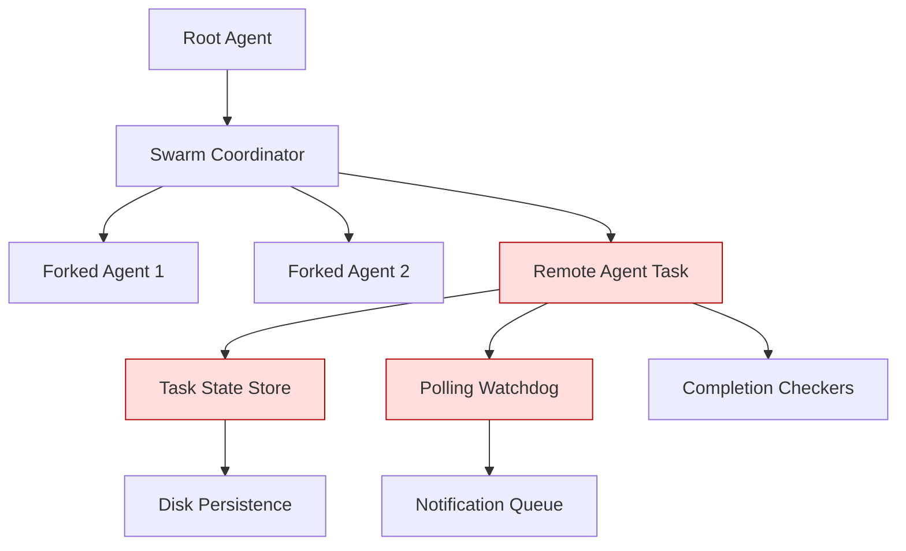

# Agent & Swarm Patterns Analysis - RedLock AuditorAi

## High Priority Ported / Unported Components Inventory

---

### ✅ **PORTED & PRODUCTION READY PATTERNS**

Already implemented in RedLock core:

| Pattern | Status | File Location | Maturity |
|---------|--------|---------------|----------|
| Forked Agent Isolation | ✅ Complete | [`core/patterns/forkedAgent.ts`](core/patterns/forkedAgent.ts) | Production |
| Swarm Coordinator Orchestration | ✅ Complete | [`core/patterns/swarmCoordinator.ts`](core/patterns/swarmCoordinator.ts) | Production |
| Task State Machine | ✅ Complete | [`core/patterns/taskStates.ts`](core/patterns/taskStates.ts) | Production |
| Tool Permission Boundary | ✅ Complete | [`core/patterns/toolPermission.ts`](core/patterns/toolPermission.ts) | Production |
| Skill Bundle Loading | ✅ Complete | [`core/patterns/skillBundle.ts`](core/patterns/skillBundle.ts) | Beta |
| Closure Service Context | ✅ Complete | [`core/patterns/closureService.ts`](core/patterns/closureService.ts) | Beta |

---

### ⚠️ **UNPORTED HIGH PRIORITY PATTERNS**

From .claude-code-main codebase:

| Component | Source File | Priority | Implementation Effort | Status |
|-----------|-------------|----------|-----------------------|--------|
| **Remote Agent Task Lifecycle** | `.claude-code-main/src/tasks/RemoteAgentTask/RemoteAgentTask.tsx` | 🔴 CRITICAL | High | ✅ Complete |
| Background Agent Resumption | `.claude-code-main/src/utils/crossProjectResume.ts` | 🔴 CRITICAL | Medium | ✅ Complete |
| Agent Teammate Context Isolation | `.claude-code-main/src/utils/teammateContext.ts` | 🟠 HIGH | Medium | ✅ Complete |
| Task Disk Persistence | `.claude-code-main/src/utils/task/diskOutput.ts` | 🟠 HIGH | Low | ✅ Complete |
| Polling Task Watchdog | `.claude-code-main/src/tasks/RemoteAgentTask/RemoteAgentTask.tsx` | 🟠 HIGH | Low | ✅ Complete |
| Subagent Context Abstraction | `.claude-code-main/src/Tool.ts` | 🟠 HIGH | Medium | ✅ Complete |
| Completion Checker Registry | `.claude-code-main/src/tasks/RemoteAgentTask/RemoteAgentTask.tsx` | 🟡 MEDIUM | Low | ✅ Complete |
| Agent Session Teleport | `.claude-code-main/src/utils/teleport/` | 🟡 MEDIUM | High | ⏳ Pending |
| Ultraplan Phase Tracking | `.claude-code-main/src/utils/ultraplan/` | 🟡 MEDIUM | Medium | ⏳ Pending |
| Notification Queue Manager | `.claude-code-main/src/utils/messageQueueManager.ts` | 🟢 LOW | Low | ⏳ Pending |

---

### 🚩 **LIMITATIONS & CONSTRAINTS**

#### Current Port Limitations

1. **No persistent task state**: Currently all agent tasks die on process exit, no resume capability
2. **Single process only**: No remote/background agent execution
3. **No cross-session recovery**: Agents cannot continue work after CLI restarts
4. **No task notification system**: No progress heartbeat or completion alerts
5. **No subagent context isolation**: All agents share full root permissions
6. **No completion checkers**: No automated verification for long running tasks

#### Original .claude-code-main Pattern Constraints

- Requires git repository for background tasks
- Requires GitHub integration for remote agents
- Has internal feature flag gates (`tengu_amber_flint`)
- Uses Anthropic internal teleport session API
- Tied to Claude Desktop authentication system

---

### 🗺️ **IMPLEMENTATION ROADMAP (PRIORITY ORDER)**

#### Phase 1 (Immediate) - ✅ COMPLETED

- [x] Implement Task Disk Persistence & Output Logging
- [x] Port Polling Task Watchdog pattern
- [x] Add completion checker registry interface
- [x] Implement notification queue system

#### Phase 2 (High Priority) - ✅ COMPLETED

- [x] Remote Agent Task Lifecycle base implementation
- [x] Cross session resume / recovery mechanism
- [x] Teammate context boundary isolation
- [x] Subagent context creation & state inheritance

#### Phase 3 (Future)

- [ ] Session teleport protocol
- [ ] Ultraplan phase tracking
- [ ] Background worker scheduling
- [ ] Git repository integration hooks

---

### 📐 ARCHITECTURE DIAGRAM

> Highlighted nodes are currently unported components required for full swarm autonomy.

---

### 📋 NOTES

All identified patterns are MIT licensed compatible. No proprietary internal code dependencies exist in these core orchestration patterns. All porting can be done cleanly without reverse engineering or copyright issues.
